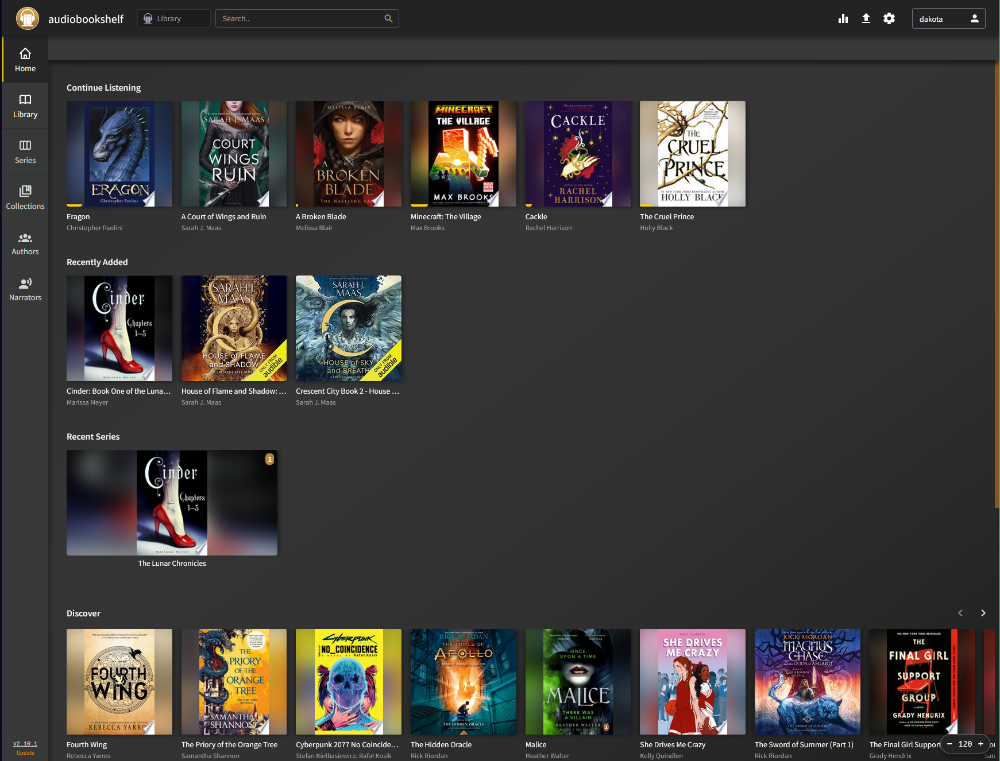

# Welcome to my AudioBook Library!
*I recommend reading this all before going through your setup.*

Welcome to my AudioBookShelf! If you're reading this, it's because I have granted you access to my audio book library.

- **So what even is AudioBookShelf?**

AudioBookShelf is a media server that I host on my own system. Think of this like Audible, but no monthly subscription required.

- **But wait, is it safe?**

Yep! I regularly scan all files in the server for viruses. I have been using this service for the better part of a year now with no issues.

- **Still interested?**

Awesome! Let me know and I'll create a username and password for you. If you are viewing from a web browser, navigate directly to the link below. If you are using the AudioBookShelf app on mobile or TV, set this as the *Server Address*.

https://abs.dakotamnichols.com/

# What's Next
## Download the mobile apps

Apple [App Store](https://testflight.apple.com/join/wiic7QIW)

Google [Play Store](https://play.google.com/store/apps/details?id=com.audiobookshelf.app)