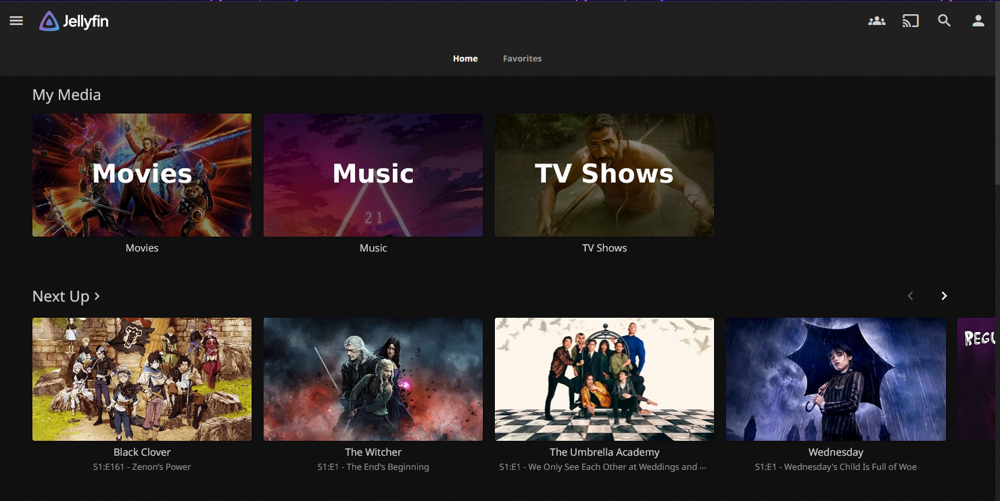

# Welcome to my Jellyfin!
*I recommend reading this all before going through your setup.*

Welcome to my Jellyfin! If you're reading this, it's because I have granted you access to my media library.

- **So what even is Jellyfin?**

Jellyfin is a media server that I host on my own system. Think of it exactly like your other favorite movie watching apps, except this one is courtesy of me.

- **But wait, is it safe?**

Yep! I regularly scan all files in the server for viruses. I have been using this service for a few years now with no issues.

- **Still interested?**

Awesome! Let me know and I'll create a username and password for you. If you are viewing from a web browser, navigate directly to the link below. If you are using the Jellyfin app on mobile or TV, set this as the *Connect to Server* host link.

https://jellyfin.dakotamnichols.com/

- **App Store Links**

- Apple: [App Store](https://apps.apple.com/us/app/jellyfin-mobile/id1480192618?mt=8)

- Android: [Play Store](https://play.google.com/store/apps/details?id=org.jellyfin.mobile)

- **Huh? But the Plex setup guide was so long!**

Yep!!! Plex is for-profit and uses a centralized account network. Jellyfin, on the other hand, has all the accounts locally on my server. That means most of those privacy steps? Not needed here. 

So why not always use Jellyfin? In general, I've noticed Plex works better for most media types, but Jellyfin offers a free streaming platform without all those fees associated with Plex. Plus, I ain't got time to manage all these guides!

# Next Steps

## Want to request more content?
Go ahead and log into: 
https://overseerr.dakotamnichols.com/

Clicking Sign In here will ask for your permission to log in from Plex.

Confirm the sign in, and you'll be able to search for any TV show or movie you want! By default there is a request limit of 8 movies and 5 TV seasons per week.

## Notice an issue with content? 
I'm going to give you 2 great options for getting my attention on something. First You can find the item on [Overseerr](https://overseerr.dakotamnichols.com/) and click on the yellow "Report Issue" button on the right hand side.

Fill out the popup dialog with detailed information like this:

*Please, for my sanity*, add details to your issue. If only one device has an issue, it might just be a spotty connection or an incompabitility with that app. *If the issue occurs on every device, then it's probably something wrong with the file itself.*