# Hello!	
*I recommend reading this all before going through your setup.*

If you're reading this, it's because I've granted you access to my Plex Library. Hi, hello, and welcome!

- **So what even is Plex?**

Plex is a media server that I host on my own system. Think of it exactly like your other favorite movie watching apps, except this one is courtesy of me.
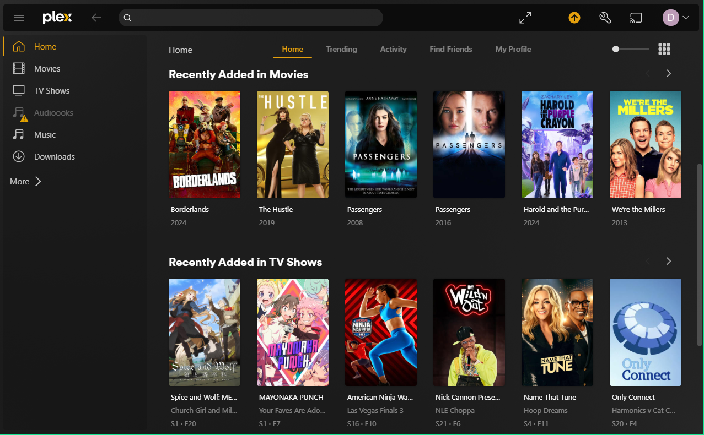

- **But wait, is it safe?**

Yep! I regularly scan all files in the server for viruses. I have been using this service for a few years now with no issues.

- **Still interested?**

Awesome! If you haven't already, give me your email address so I can invite you. Alternatively, if you already have a Plex account you can also send me your username.

# Let's Get Started
*This guide will assume that you are at a PC, but the steps should be similar from a phone.*

Check your email. You got an email from noreply@plex.tv with the subject "You've been invited to share some media in Plex" 
*Don't worry about this wording. The only way you can share you media with me is if you specifically download the server software and configure it. You'd definitely know if you were sharing.*

The invite will look something like this:

Press "I accept the invitation"

Once clicked, you're browser of choice will open to a sign in page for Plex. If you already have an account, just sign in! Otherwise, I recommend clicking the "sign up with email" under the "Sign In" button instead of attaching Plex to your Google, Facebook, or Apple account. It won't hurt anything, but why give your info to these companies for free?
**Just make sure that whatever sign in method you use has the same email I sent the invite to.**

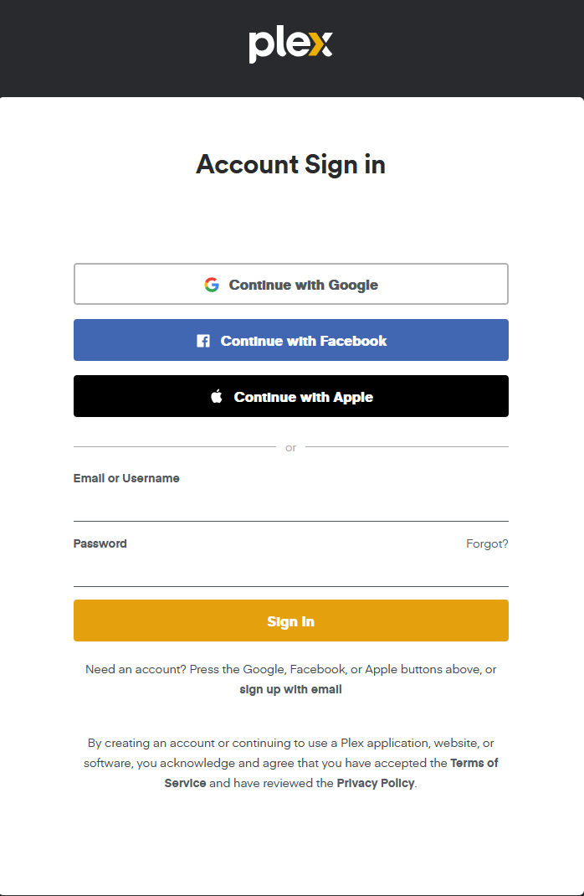

If you've signed in from your computer, you'll be dropped into the *Manage Library Access* page. You'll notice my account and the fact that you have access to the number of libraries I shared with you.

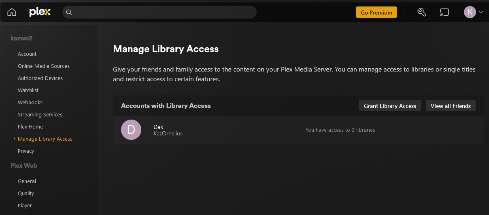

*These settings should also exist in the apps for Plex, but the method of getting to the settings is different on every device. On the phone, click the triple horizontal lines and then the cog. On a TV, there is often a "Settings" cog as the bottom left most option.*

Under the Plex Web header in the left side menu, click on the *Quality* link. Here you can adjust the default streaming quality. I recommend setting this to Maximum unless your internet is slow.

*Note: You may also set "Automatically adjust quality (Beta)" to on if you are having issues streaming.*
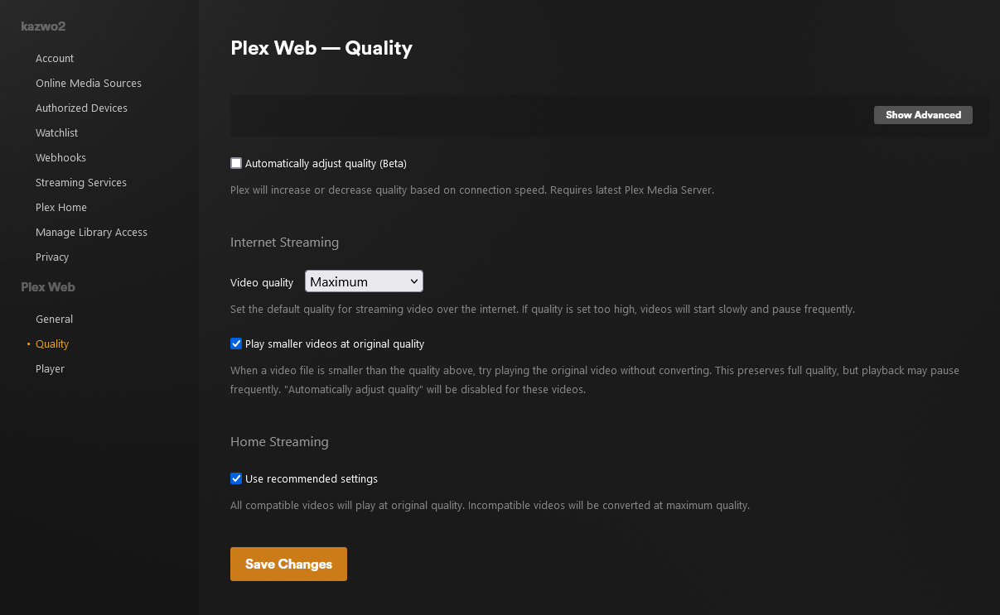

Now click on the *Player* tab and click "Show Advanced" in the top of the new window. While it's not normally an issue, you can uncheck the *Normalize Multi-channel Audio* box at the top. Feel free to also look at the subtitle and Cinema Trailers options if they interest you.

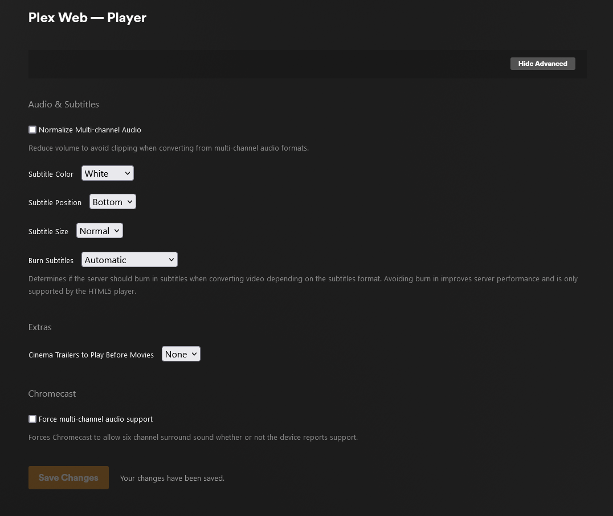

**Finally**, click the Home icon in the top left corner. You'll be taken to the "Plex Web Setup" page. Uncheck everything that isn't "Movies", "TV Shows", and "Music" (With the musical note icon, if you want it). These are the 3 libraries I have shared with you.
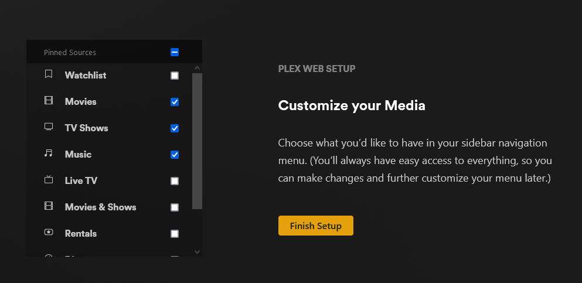

Everything else that is listed here are services provided by Plex. They can always be enabled later, but I recommend disabling them. Once you're done, press "Finish Setup". 

Next, Plex will ask if you want to share you watch history. 
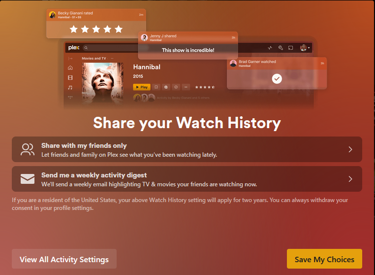

I recommend setting these options to **private** and **Don't send me activity digests**.
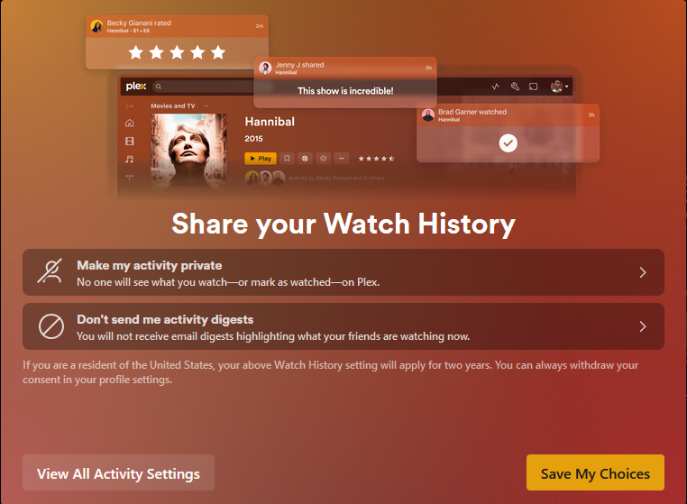

Press Accept once you've set your preferences.

Now you're set to browse everything on the server!

# Next Steps
## Download Apps

So here's the bad news. If you're wanting to watch on your phone, you'll likely want the Plex app. Unfortunately, on mobile devices you'll have to pay a $5 fee to gain access to streaming.

If you're on a computer, I recommend getting the desktop app from [here](https://www.plex.tv/media-server-downloads/?cat=plex+desktop&plat=win#plex-app)

Plex is also available on all major streaming devices. Support includes most smart TVs, streaming boxes like an Apple TV or SHIELD, and can even be Chromecast.

## Want to request more content?
Go ahead and log into: 
https://overseerr.dakotamnichols.com/

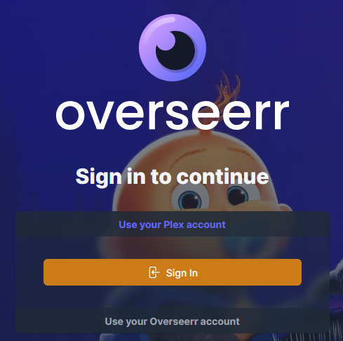

Clicking Sign In here will ask for your permission to log in from Plex.
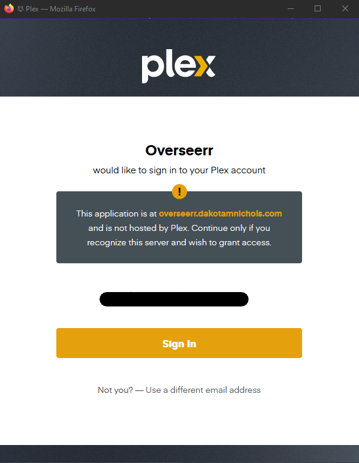

Confirm the sign in, and you'll be able to search for any TV show or movie you want! By default there is a request limit of 8 movies and 5 TV seasons per week.
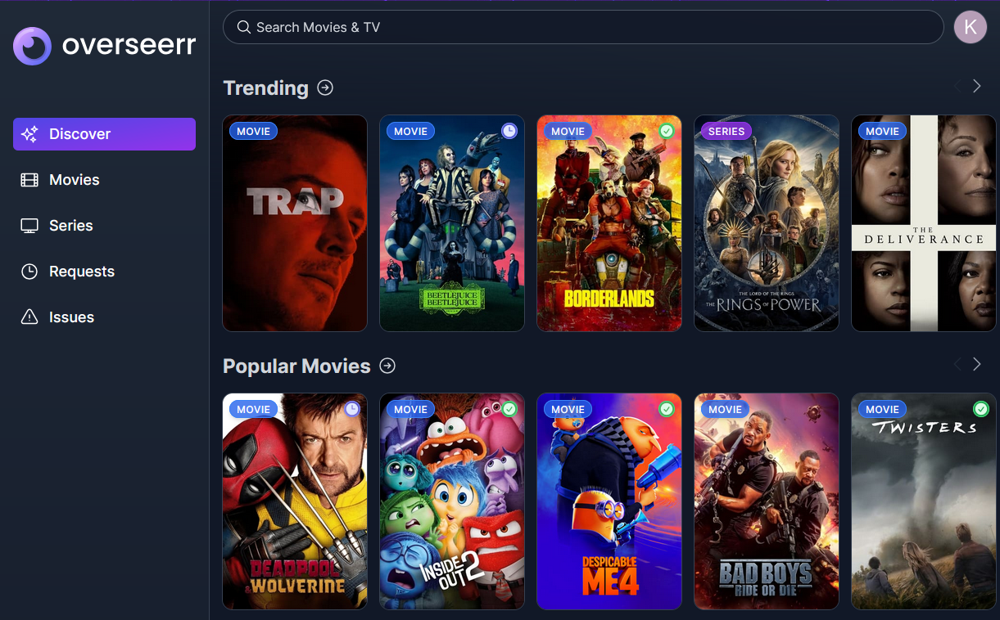

## Notice an issue with content? 
I'm going to give you 2 great options for getting my attention on something. First You can find the item on [Overseerr](https://overseerr.dakotamnichols.com/) and click on the yellow "Report Issue" button on the right hand side.
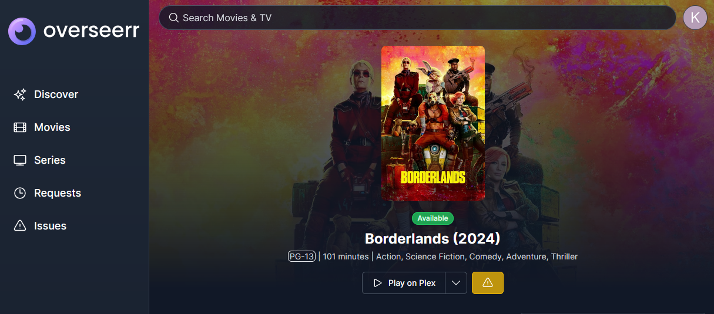

Fill out the popup dialog with detailed information like this:
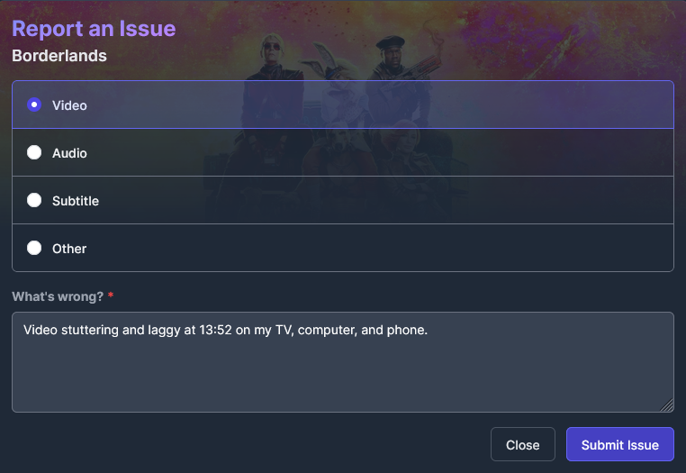

*Please, for my sanity*, add details to your issue. If only one device has an issue, it might just be a spotty connection or an incompabitility with that app. *If the issue occurs on every device, then it's probably something wrong with the file itself.*

Your second option is directly in Plex. Anywhere you can see the media, click the elipses "**...**" and then "Report Issue..."

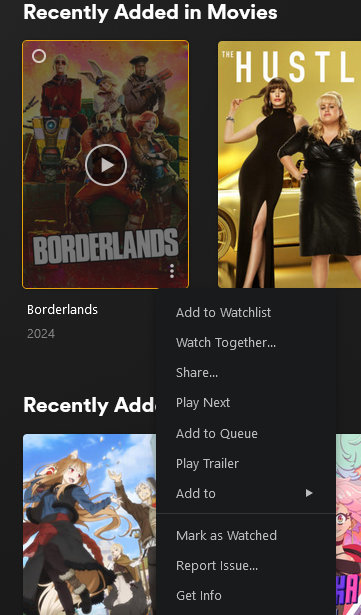
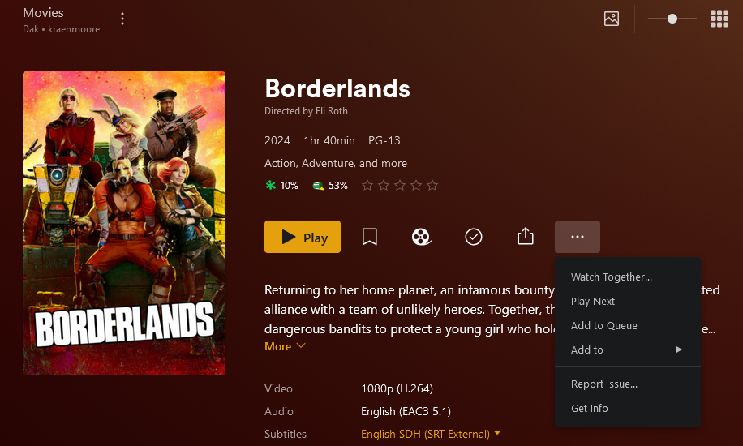

Then fill out the details:
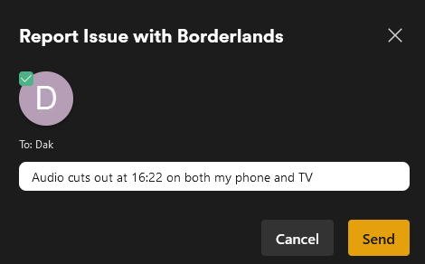

Thank you for reading, and I hope you enjoy!